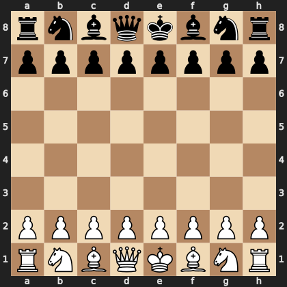

<div align="center">

<!-- Typing Animation -->
<a href="https://git.io/typing-svg"></a>

<br/>

<!-- Snake Contribution Graph -->
<picture>
  <source media="(prefers-color-scheme: dark)" srcset="https://raw.githubusercontent.com/Tahmid1999/Tahmid1999/output/github-snake-dark.svg" />
  <source media="(prefers-color-scheme: light)" srcset="https://raw.githubusercontent.com/Tahmid1999/Tahmid1999/output/github-snake.svg" />
  
</picture>

</div>

---

<!-- Community Chess Game -->
## ♟️ Chess — You vs AI 🤖

*Play White against my AI! Click any move below — the bot responds instantly.*

<!-- CHESS:START -->
⬜ You (White) vs 🤖 AI (Black) · Move **#1**

<div align="center">
  
</div>


> ⬜ **Your turn (White)** — Click any move, the AI will respond! 🤖

<details open><summary>🎯 Available Moves</summary>

**♞ Knight**

| From | Available Moves |
|:----:|:----------------|
| **b1** | [`a3`](https://github.com/Tahmid1999/Tahmid1999/issues/new?title=chess%7Cmove%7Cb1a3&body=I%27m%20playing%20%2A%2AKnight%2A%2A%20from%20%60b1%60%20%E2%86%92%20%60a3%60%0A%0A%2AThe%20AI%20will%20respond%20automatically%21%2A%20%F0%9F%A4%96%E2%99%9F%EF%B8%8F) [`c3`](https://github.com/Tahmid1999/Tahmid1999/issues/new?title=chess%7Cmove%7Cb1c3&body=I%27m%20playing%20%2A%2AKnight%2A%2A%20from%20%60b1%60%20%E2%86%92%20%60c3%60%0A%0A%2AThe%20AI%20will%20respond%20automatically%21%2A%20%F0%9F%A4%96%E2%99%9F%EF%B8%8F) |
| **g1** | [`f3`](https://github.com/Tahmid1999/Tahmid1999/issues/new?title=chess%7Cmove%7Cg1f3&body=I%27m%20playing%20%2A%2AKnight%2A%2A%20from%20%60g1%60%20%E2%86%92%20%60f3%60%0A%0A%2AThe%20AI%20will%20respond%20automatically%21%2A%20%F0%9F%A4%96%E2%99%9F%EF%B8%8F) [`h3`](https://github.com/Tahmid1999/Tahmid1999/issues/new?title=chess%7Cmove%7Cg1h3&body=I%27m%20playing%20%2A%2AKnight%2A%2A%20from%20%60g1%60%20%E2%86%92%20%60h3%60%0A%0A%2AThe%20AI%20will%20respond%20automatically%21%2A%20%F0%9F%A4%96%E2%99%9F%EF%B8%8F) |

**♟ Pawn**

| From | Available Moves |
|:----:|:----------------|
| **a2** | [`a3`](https://github.com/Tahmid1999/Tahmid1999/issues/new?title=chess%7Cmove%7Ca2a3&body=I%27m%20playing%20%2A%2APawn%2A%2A%20from%20%60a2%60%20%E2%86%92%20%60a3%60%0A%0A%2AThe%20AI%20will%20respond%20automatically%21%2A%20%F0%9F%A4%96%E2%99%9F%EF%B8%8F) [`a4`](https://github.com/Tahmid1999/Tahmid1999/issues/new?title=chess%7Cmove%7Ca2a4&body=I%27m%20playing%20%2A%2APawn%2A%2A%20from%20%60a2%60%20%E2%86%92%20%60a4%60%0A%0A%2AThe%20AI%20will%20respond%20automatically%21%2A%20%F0%9F%A4%96%E2%99%9F%EF%B8%8F) |
| **b2** | [`b3`](https://github.com/Tahmid1999/Tahmid1999/issues/new?title=chess%7Cmove%7Cb2b3&body=I%27m%20playing%20%2A%2APawn%2A%2A%20from%20%60b2%60%20%E2%86%92%20%60b3%60%0A%0A%2AThe%20AI%20will%20respond%20automatically%21%2A%20%F0%9F%A4%96%E2%99%9F%EF%B8%8F) [`b4`](https://github.com/Tahmid1999/Tahmid1999/issues/new?title=chess%7Cmove%7Cb2b4&body=I%27m%20playing%20%2A%2APawn%2A%2A%20from%20%60b2%60%20%E2%86%92%20%60b4%60%0A%0A%2AThe%20AI%20will%20respond%20automatically%21%2A%20%F0%9F%A4%96%E2%99%9F%EF%B8%8F) |
| **c2** | [`c3`](https://github.com/Tahmid1999/Tahmid1999/issues/new?title=chess%7Cmove%7Cc2c3&body=I%27m%20playing%20%2A%2APawn%2A%2A%20from%20%60c2%60%20%E2%86%92%20%60c3%60%0A%0A%2AThe%20AI%20will%20respond%20automatically%21%2A%20%F0%9F%A4%96%E2%99%9F%EF%B8%8F) [`c4`](https://github.com/Tahmid1999/Tahmid1999/issues/new?title=chess%7Cmove%7Cc2c4&body=I%27m%20playing%20%2A%2APawn%2A%2A%20from%20%60c2%60%20%E2%86%92%20%60c4%60%0A%0A%2AThe%20AI%20will%20respond%20automatically%21%2A%20%F0%9F%A4%96%E2%99%9F%EF%B8%8F) |
| **d2** | [`d3`](https://github.com/Tahmid1999/Tahmid1999/issues/new?title=chess%7Cmove%7Cd2d3&body=I%27m%20playing%20%2A%2APawn%2A%2A%20from%20%60d2%60%20%E2%86%92%20%60d3%60%0A%0A%2AThe%20AI%20will%20respond%20automatically%21%2A%20%F0%9F%A4%96%E2%99%9F%EF%B8%8F) [`d4`](https://github.com/Tahmid1999/Tahmid1999/issues/new?title=chess%7Cmove%7Cd2d4&body=I%27m%20playing%20%2A%2APawn%2A%2A%20from%20%60d2%60%20%E2%86%92%20%60d4%60%0A%0A%2AThe%20AI%20will%20respond%20automatically%21%2A%20%F0%9F%A4%96%E2%99%9F%EF%B8%8F) |
| **e2** | [`e3`](https://github.com/Tahmid1999/Tahmid1999/issues/new?title=chess%7Cmove%7Ce2e3&body=I%27m%20playing%20%2A%2APawn%2A%2A%20from%20%60e2%60%20%E2%86%92%20%60e3%60%0A%0A%2AThe%20AI%20will%20respond%20automatically%21%2A%20%F0%9F%A4%96%E2%99%9F%EF%B8%8F) [`e4`](https://github.com/Tahmid1999/Tahmid1999/issues/new?title=chess%7Cmove%7Ce2e4&body=I%27m%20playing%20%2A%2APawn%2A%2A%20from%20%60e2%60%20%E2%86%92%20%60e4%60%0A%0A%2AThe%20AI%20will%20respond%20automatically%21%2A%20%F0%9F%A4%96%E2%99%9F%EF%B8%8F) |
| **f2** | [`f3`](https://github.com/Tahmid1999/Tahmid1999/issues/new?title=chess%7Cmove%7Cf2f3&body=I%27m%20playing%20%2A%2APawn%2A%2A%20from%20%60f2%60%20%E2%86%92%20%60f3%60%0A%0A%2AThe%20AI%20will%20respond%20automatically%21%2A%20%F0%9F%A4%96%E2%99%9F%EF%B8%8F) [`f4`](https://github.com/Tahmid1999/Tahmid1999/issues/new?title=chess%7Cmove%7Cf2f4&body=I%27m%20playing%20%2A%2APawn%2A%2A%20from%20%60f2%60%20%E2%86%92%20%60f4%60%0A%0A%2AThe%20AI%20will%20respond%20automatically%21%2A%20%F0%9F%A4%96%E2%99%9F%EF%B8%8F) |
| **g2** | [`g3`](https://github.com/Tahmid1999/Tahmid1999/issues/new?title=chess%7Cmove%7Cg2g3&body=I%27m%20playing%20%2A%2APawn%2A%2A%20from%20%60g2%60%20%E2%86%92%20%60g3%60%0A%0A%2AThe%20AI%20will%20respond%20automatically%21%2A%20%F0%9F%A4%96%E2%99%9F%EF%B8%8F) [`g4`](https://github.com/Tahmid1999/Tahmid1999/issues/new?title=chess%7Cmove%7Cg2g4&body=I%27m%20playing%20%2A%2APawn%2A%2A%20from%20%60g2%60%20%E2%86%92%20%60g4%60%0A%0A%2AThe%20AI%20will%20respond%20automatically%21%2A%20%F0%9F%A4%96%E2%99%9F%EF%B8%8F) |
| **h2** | [`h3`](https://github.com/Tahmid1999/Tahmid1999/issues/new?title=chess%7Cmove%7Ch2h3&body=I%27m%20playing%20%2A%2APawn%2A%2A%20from%20%60h2%60%20%E2%86%92%20%60h3%60%0A%0A%2AThe%20AI%20will%20respond%20automatically%21%2A%20%F0%9F%A4%96%E2%99%9F%EF%B8%8F) [`h4`](https://github.com/Tahmid1999/Tahmid1999/issues/new?title=chess%7Cmove%7Ch2h4&body=I%27m%20playing%20%2A%2APawn%2A%2A%20from%20%60h2%60%20%E2%86%92%20%60h4%60%0A%0A%2AThe%20AI%20will%20respond%20automatically%21%2A%20%F0%9F%A4%96%E2%99%9F%EF%B8%8F) |

</details>


[🔄 New Game](https://github.com/Tahmid1999/Tahmid1999/issues/new?title=chess%7Cnew&body=Start%20a%20fresh%20chess%20game%20vs%20AI%21%0A%0A%2AProcessed%20automatically.%2A%20%E2%99%9F%EF%B8%8F)
<!-- CHESS:END -->

---

<!-- About Me Section -->
## 🧑‍💻 About Me

```yaml
name: Tahmid Alavi Ishmam
role: Full-Stack Developer & Mobile Architect

currently_working_on:
  - Live Streaming Platforms (Flutter + LiveKit)
  - Automation Bots & Scrapers
  - Cross-Platform Mobile Applications

passions:
  - Clean Architecture & Design Patterns
  - Real-time Communication (WebRTC, LiveKit, Agora)
  - Building tools that solve real problems
```

---

<!-- Tech Stack -->
## ⚡ Tech Stack

<div align="center">

### 📱 Mobile Development
<p>


</p>

### 🌐 Backend & Web
<p>


</p>

### 🗄️ Databases & Cloud
<p>


</p>

### 🔧 Tools & Platforms
<p>


</p>

### 🎥 Real-time & Streaming
<p>


</p>

</div>

---

<!-- GitHub Stats Section -->
## 📊 GitHub Analytics

<div align="center">

<picture>
  <source media="(prefers-color-scheme: dark)" srcset="https://github-readme-stats-sigma-five.vercel.app/api?username=Tahmid1999&show_icons=true&theme=github_dark&hide_border=true&bg_color=0d1117&title_color=58a6ff&icon_color=58a6ff&text_color=c9d1d9&count_private=true" />
  
</picture>
<picture>
  <source media="(prefers-color-scheme: dark)" srcset="https://github-readme-stats-sigma-five.vercel.app/api/top-langs/?username=Tahmid1999&layout=compact&theme=github_dark&hide_border=true&bg_color=0d1117&title_color=58a6ff&text_color=c9d1d9&langs_count=8" />
  
</picture>

</div>

<br/>

<div align="center">
  
</div>

---

<!-- Activity Graph -->
## 📈 Contribution Graph

<div align="center">
  
</div>

---

<!-- What I'm Working On -->
## 🔭 What I'm Working On

<table align="center">
<tr>
<td width="50%" valign="top">

### 📱 Mobile Apps
- 🎬 **Live Streaming Platform** — Flutter + LiveKit with real-time video, beauty filters & in-app economy
- 🏢 **ERP Systems** — Full-featured enterprise resource planning mobile apps

</td>
<td width="50%" valign="top">

### 🤖 Automation & Bots
- 🏛️ **Vatican Ticket Watcher** — Telegram bot monitoring Vatican Museums ticket availability
- 🔧 **Web Scrapers** — Intelligent automation tools for data extraction

</td>
</tr>
</table>

---

<!-- Connect Section -->
## 🤝 Connect With Me

<div align="center">
<a href="mailto:tahmidalavi1999@gmail.com"></a>
<a href="https://wa.me/8801770664066"></a>

<br/><br/>


</div>


